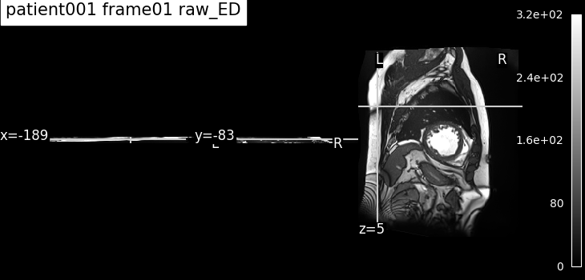
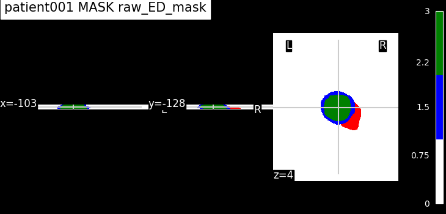
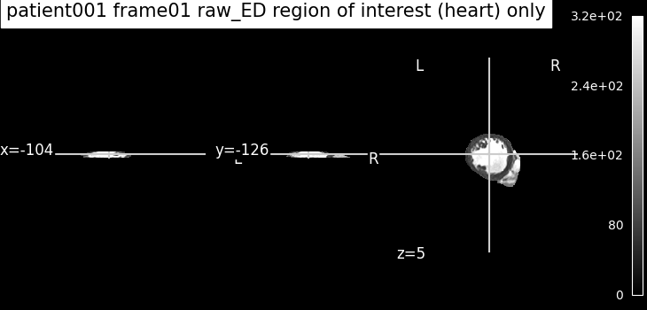
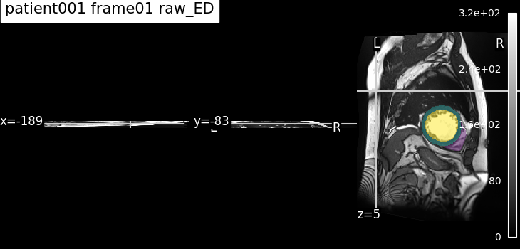

# 00 — MRI Visualization

> How to plot the cardiac MRI data — raw ACDC or preprocessed — with
> `run_visualize.py`. This is the inspection tool used to sanity-check images
> and masks at every stage of the pipeline.

## 1. Objective

Before any analysis, we need to *look* at the data: check that a frame loads,
that the ground-truth mask lines up with the heart, and that each preprocessing
step (resampling → cropping → registration) did what it should. `run_visualize.py`
is the single entry point for all of this — one config file selects the patient,
the source (raw or processed), the frame, and what to draw.

## 2. Method — what the code does

**Entry point:** [`scripts/run_visualize.py`](../../scripts/run_visualize.py)
**Config:** [`config_files/visualization.yaml`](config_files/visualization.yaml)
**Core functions:** [`src/visualization/mri_plots.py`](../../src/visualization/mri_plots.py)

Pipeline, in the order the script runs it:

1. **Read the config** (`configs/visualization.yaml`): patient, source, frame type, plot modes.
2. **Resolve the frame number.** ED/ES are not fixed indices — the exact frame number is read from the patient's `Info.cfg` in `DATADIR` (via `read_info_cfg`). The `training`/`testing` subset is inferred from the patient id (≤ 100 → training).
3. **Build the file path** for the requested source:
   - `raw` + `frame` → `patientXXX_frameNN.nii.gz` from `DATADIR` (+ `_gt` mask).
   - `raw` + `4d` → the full cine volume `patientXXX_4d.nii.gz` (frame type ignored).
   - `processed` → `patientXXX_frameNN{suffix}.nii.gz` from `PROCESSED_IMAGES_FOLDER/<folder>`, where the suffix is derived from the folder (`registered_frames → _registered`, `resampled_frames → _resampled`, `cropped_frames → _cropped`).
4. **Draw** the requested `plot_modes` and save one PNG per plot to `RESULTS_FOLDER`. A missing file is skipped with a printed `[SKIP]` (never a crash); masks absent from disk silently skip the mask/overlay modes.

Key parameters (from `config_files/visualization.yaml`):

| Parameter | Value | Meaning |
|-----------|-------|---------|
| `patient_id` | `1` | which ACDC patient (1–150) |
| `source` | `processed` | `raw` (from `DATADIR`) or `processed` (from `PROCESSED_IMAGES_FOLDER`) |
| `raw_file_type` | `frame` | for `raw` only: `frame` (single ED/ES) or `4d` (full cine) |
| `folder` | `registered_frames` | for `processed` only: which stage to show |
| `frame_type` | `both` | `ED`, `ES`, or `both` (ignored for raw 4D) |
| `plot_modes` | `[image, mask, overlay]` | combinable — see below |
| `epoch_limit` | `5` | max timeframes drawn in `all_epochs` mode |

**Plot modes** (combinable in one run):
- `image` — the 3D image alone.
- `mask` — the ground-truth mask alone (skipped silently if no mask on disk).
- `overlay` — image + mask superimposed, **and** the masked region-of-interest (heart) only.
- `all_epochs` — every timeframe of a cine volume (only for `source: raw`, `raw_file_type: 4d`).

## 3. Results

Output PNGs land in `RESULTS_FOLDER` with a self-describing name:
`patientXXX_frameNN_<source>_<suffix>_<frame_type>[...].png`.

**Image + ground-truth overlay (processed, registered, ED).** The overlay
confirms the mask still matches the anatomy after registration.

(Raw image, heart (ROI) mask, image (ROI only), superposed image+mask)

## 4. Conclusion

`run_visualize.py` is the visual backbone of the project: a single config
produces consistent, named figures for raw and processed data at any pipeline
stage. The underlying plotting functions in `mri_plots.py` (`plot_oneimg`,
`plot_onemask`, `plot_oneimagemask`, `plot_allepochs`) are reused directly by the
PCA reports (temporal and spatial) and AE for eigenvectors and reconstructions, so the
figures stay consistent across the whole project.

## 5. Reproduce

- Take `visualization.yaml` in `config_files/` from this folder, and put it in the general `configs/` folder.
- Run `scripts/run_visualize.py`.
- Expected outputs: the figures in `figures/`.

To reproduce the raw-4D panels, set in the config: `source: raw`,
`raw_file_type: 4d` (then `frame_type` and `plot_modes` are overridden to
`all_epochs` automatically).

## 6. Notes & limitations

- **Frame numbers come from `Info.cfg`.** ED is the first frame; ES varies per
  patient. Visualization therefore requires the raw ACDC tree in `DATADIR` even
  when showing processed files (that is where `Info.cfg` lives).
- **Masks are optional.** If a `_gt` mask is not on disk, `mask` and `overlay`
  are skipped silently — an image-only figure is still produced.
- **`all_epochs` is raw-4D only.** For any other source the mode does nothing.
- **No MLflow tracking** — this is a plotting utility; figures go straight to
  `RESULTS_FOLDER`.