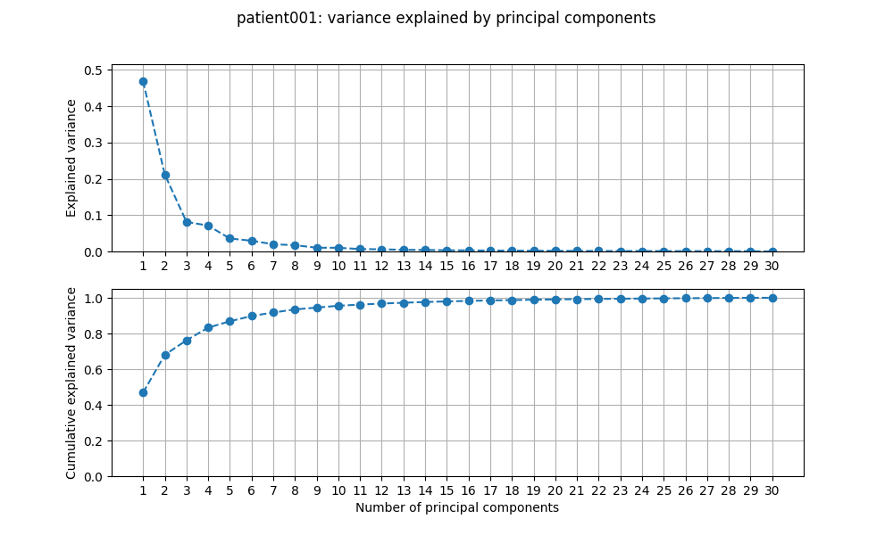
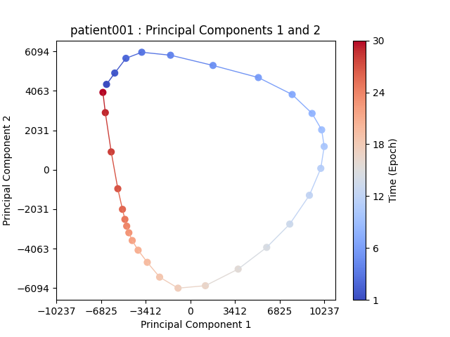
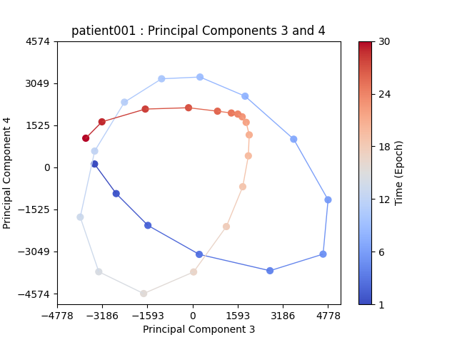
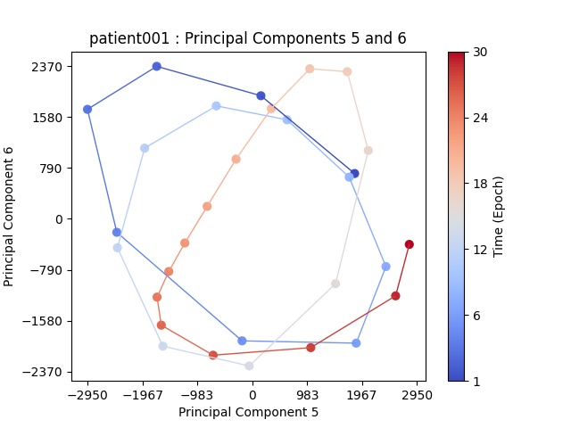
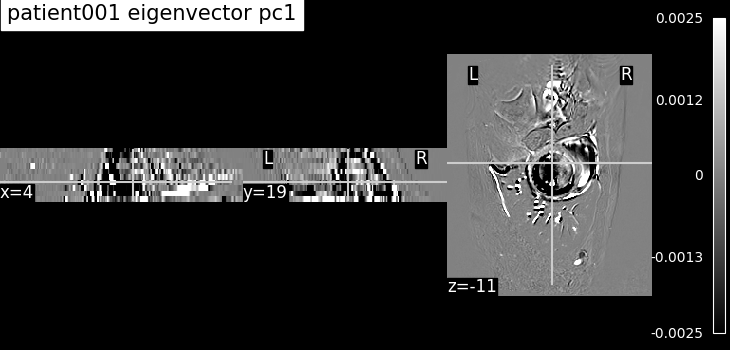
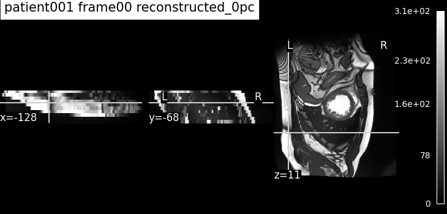
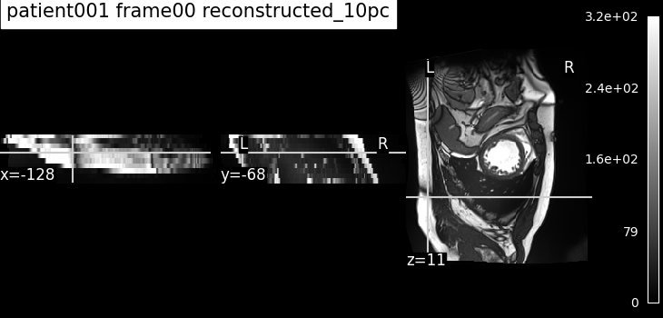

# 01 — Temporal PCA

> Per-patient PCA. Each patient has a 4D (3D+time) MRI, and the various frames 
> are the sample: the principal components describe how voxel intensities co-vary in
> time. A first dimensionality-reduction baseline before starting across-patient 
> (spatial) analysis.

## 1. Objective

A cine-MRI acquisition gives, for one patient, a 4D volume `(x, y, z, t)`: the
same 3D heart imaged at `t ≈ 30` timeframes spanning accross approximatively one 
cardiac cycle. Temporal PCA treats **each timeframe as a sample** and 
**each voxel as a feature**. The maximum number of principal components required 
here to fully reconstruct the image correspond to the number of sample (`t ≈ 30`).
The goal is to checkhow many degrees of freedom does the cardiac motion actually have, 
how many components we need to fairly reconstruction the IRM images, and what the 
latent space representations can teach us.

## 2. Method — what the code does

**Entry point:** [`scripts/run_pca_temporal.py`](../../scripts/run_pca_temporal.py)
**Config:** [`configs/pca_temporal.yaml`](configs/pca_temporal.yaml)
**Core functions:** [`src/models/pca.py`](../../src/models/pca.py)

Pipeline, in the order the script runs it:

1. **Load** the patient's 4D NIfTI via `importdata.get_patient_acdc_path(patient_id, file_type="4d")` → array `(x, y, z, t)`.
2. **Reshape** with `pca1_transpose`: transpose to put time first, then flatten the spatial dims → `X` of shape `(t, n_voxels)`, i.e. `~30` rows and `>100 000` columns.
3. **Fit PCA** with `sklearn.decomposition.PCA(n_components=min(t, max_pc_calc))`, then `fit_transform(X)`. sklearn centers each column (per-voxel temporal mean) internally — the pipeline relies on this **single** centering. The fitted model is logged to MLflow as `patient{XXX}_pca.joblib`.
4. **Explained variance** is logged per component (`explained_variance_pc{i}`) and plotted (`plot_pca_explipower`).
5. **PC scores in the eigenbase**: 2D scatter of PC(i) vs PC(i+1) for consecutive pairs up to `pc_max` (`plot_pcvalues_2d`) (this is where the cyclic structure appears).
6. **Eigenvectors as images**: each component is reshaped back to a 3D volume with `eigenvector_to_nii` (reusing the patient's affine/header) and plotted.
7. **Reconstruction**: the mean image (`pca.mean_`, i.e. 0 PC) plus a reconstruction from the first `n_pc` components via `pca1_reconstruct` (`X_reduced[:, :n_pc] @ components_[:n_pc] + mean_`), for the requested frames.

**CALC vs LOAD.** `recalculate_pca: true` fits and logs a new model; `recalculate_pca: false` + `load_run_id` reloads the joblib from a past MLflow run and only regenerates the plots — so the figures in `figures/` can always be reproduced without recomputing.

Key parameters (from `configs/pca_temporal.yaml`):

| Parameter | Value | Meaning |
|-----------|-------|---------|
| `patient_id` | `27` | which ACDC patient (→ `patient027`) |
| `max_pc_calc` | `100` | cap on components computed (actual = `min(t, 100)`) |
| `pc_max` | `10` | eigenbase scatter for PC pairs up to 10 (must be even) |
| `eigenvectors_to_plot` | `[1, 2, 3]` | which components to render as 3D images |
| `n_pc_to_reconstruct` | `1` | components used in the reconstruction |
| `frames_to_reconstruct` | `[0]` | which timeframe(s) to reconstruct (or `"all"`) |

## 3. Results

**Explained variance — the cycle is low-rank.** A handful of components - typically 5 
to 10, depending on the patient - already capture ~90% of the variance, the last 20 
to 25 are mostly noise.

**PC scores in the eigenbase — the cardiac cycle.** Plotting PC1 against PC2
traces out a closed loop: consecutive timeframes follow one another around the
cycle and return to the start -> the cyclic nature of the cardiac cycle is visible in
the latent space. Higher pairs (PC3–PC4, …) show harmonics of this
fundamental motion.

**Eigenvectors as images.** The leading components, reshaped to the volume,
localize where in the heart the intensity varies most over the cycle.

**Reconstruction.** The variations of the IRM images along the cardiac cycle for 
a single patient are light compared to the mean image (0 PC): this mean image over 
all the epochs for this patient is already close to the original image, and adding 
PCs helps to get closer to the exact match.

## 4. Conclusion

Temporal PCA gives a compact, interpretable description of a single patient's
cardiac cycle: a few components explain most of the variance, and their scores
trace the cycle (with harmonics) in the eigenbase. Beyond the physiological
read, this stage validated the PCA fit, the eigenvector-to-NIfTI mapping and the
reconstruction path that the **spatial** PCA (report 03) and the AE comparisons
will reuse.

## 5. Reproduce

Take the chosen .yaml in configs_files/ from this folder, rename it as pca_temporal.yaml 
and put it the configs/ general folder.
Then run the script run_pca_temporal.py 
Expected outputs: the figures in figures/

## 6. Notes & limitations

- **Per-patient, not a population model.** Each run describes one patient's
  cycle; it is not comparable across patients (that is what spatial PCA does).
- **Centering convention matters.** sklearn's `PCA` already centers columns.
  An earlier version subtracted the mean a second time; with that wrong
  normalization the eigenbase structure did not come out cleanly. The current
  code centers exactly once — do not reintroduce a manual mean subtraction here.
- **Requires the 4D file** for the patient (`file_type="4d"`); `pc_max` must be
  even.