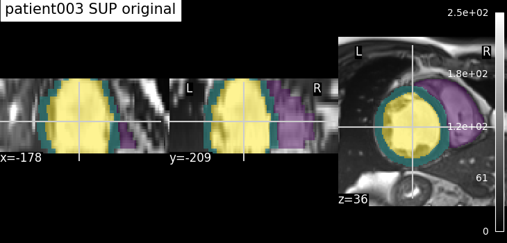
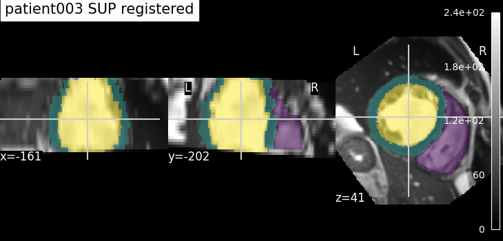

# 02 — Registration

> Bring every patient's heart into a common spatial frame — same voxel spacing,
> same crop window, same orientation — by rigidly registering each frame to a
> single reference. This is the prerequisite that makes across-patient methods
> (spatial PCA, autoencoders) meaningful: voxel *i* must mean the same
> anatomical location for every patient.

## 1. Objective

Temporal PCA (report 01) worked *within* one patient. To compare or pool
patients, their hearts first have to be spatially aligned, because raw ACDC
frames differ in voxel spacing, field of view, heart position and orientation.
This stage builds a preprocessing pipeline — **resample → crop → register** —
that maps every frame onto the grid of one fixed reference (`patient001`, ED
frame). Alignment quality is quantified by the **Dice overlap** of the
segmentation masks against that reference, before vs after registration.

## 2. Method — what the code does

**Entry point:** [`scripts/run_registration.py`](../../scripts/run_registration.py)
**Config:** [`config_files/registration.yaml`](config_files/registration.yaml)
**Core functions:** [`src/data/resampling.py`](../../src/data/resampling.py), [`src/data/geometry.py`](../../src/data/geometry.py), [`src/data/registration.py`](../../src/data/registration.py)

Pipeline, in the order the script runs it (each step gated by a flag in the YAML):

1. **Resample** (`resampling.resample_all`) — every frame and its mask to a common
   physical voxel size `target_spacing` (mm), so one voxel means the same physical
   extent for all patients. Masks are resampled label-preserving. → `resampled_frames/`
   (`patientXXX_frameNN_resampled.nii.gz`, `_gt`).
2. **Crop** (`geometry.crop_all_frames`) — a fixed window `crop_shape` (voxels)
   around the cardiac centroid, giving every frame identical array dimensions.
   → `cropped_frames/` (`_cropped`).
3. **Register** (`registration.register_all_frames`) — a **rigid** transform
   (`Euler3D`: 3 rotations + 3 translations) per frame onto the fixed reference.
   The key design point: the transform is **estimated on the cropped binary masks**
   (fixed vs moving), then **applied to the full resampled image** (linear
   interpolation) **and the full multi-label mask** (nearest-neighbour), resampled
   onto the reference grid; the output is optionally cropped back to the reference
   window (`crop_after_registration`). Estimating on the binary mask means the
   optimiser maximises anatomical overlap of the heart directly — exactly what
   Dice then measures. The reference frame itself is copied unchanged.
   → `registered_frames/` (`_registered`, `_gt`).

There is **no MLflow tracking** for preprocessing — outputs go to `processed_images/`.

**Pipeline checks** (optional, `run_pipelinechecks: true`):
- *Visual* — image / mask / overlay plots at each stage for a chosen set of
  patients (`patients_ED`, `patients_ES`), to eyeball alignment.
- *Dice* (`do_dice_checks: true`) — for every frame, Dice **before** (cropped
  moving mask vs cropped reference mask) and **after** (registered moving mask vs
  reference), printed and saved to `dice_All_frames.csv` +
  `dice_summary_All_frames.txt` in `RESULTS_FOLDER`, with an ED-only / ES-only
  breakdown and the worst-N frames. An older registration folder can be compared
  via `registered_OLD`.

Key parameters (from `config_files/registration.yaml`):

| Parameter | Value | Meaning |
|-----------|-------|---------|
| `target_spacing` | `[1.5, 1.5, 3.15]` | common voxel size in mm (x, y, z) — anisotropic, coarser through-plane |
| `crop_shape` | `[128, 128, 32]` | crop window in voxels around the cardiac centroid |
| `reference_patient` / `reference_frame` | `patient001` / `frame01` | fixed target (ED frame) all frames register to |
| `n_iterations` | `200` | optimiser iterations for the rigid transform |
| `do_dice_checks` | `true` | compute + save the before/after Dice evaluation |

## 3. Results

The Dice evaluation runs over the registered frames — up to **300** (150 patients
× ED + ES). "Before" is the overlap achieved by resampling + centroid-crop alone;
"after" adds the rigid registration.

| Metric | Before | After |
|--------|--------|-------|
| mean Dice   | `0.698` | `0.723` |
| median Dice | `0.713` | `<0.739` |
| frames improved / equal / worse | — | `282` / `1` / `17` |

The improvement is **modest but real**. The rigid step *refines* orientation and position
of the unaligned images rather than performing a large correction, and does only a minor 
modification to the images already correctly aligned. 
The value of registration is not a dramatic Dice jump but a consistent, per-voxel-comparable grid across patients: 
more than 90% of the frames are improved.

**Visual check — overlay before vs after (moving patient).** The mask overlay on
the cropped frame vs the registered frame shows the heart snapping onto the
reference orientation.

*A moving patient (`patient003`, ED) before and after registration; the reference
is `patient001_frame01`.

## 4. Conclusion

The preprocessing pipeline puts all hearts on a shared voxel grid and orientation,
and Dice confirms the segmentation masks overlap the reference well for the large
majority of frames. Because the centroid crop already provides coarse alignment,
the rigid registration is a refinement — consistent with the modest Dice gain.
This shared spatial frame is precisely what lets report 03 (spatial PCA *across*
patients) and the autoencoders treat a voxel as a comparable feature from one
patient to the next.

## 5. Reproduce

- Take `registration.yaml` in `config_files/` from this folder, and put it in the
  general `configs/` folder.
- Run `scripts/run_registration.py`. Outputs: processed frames in
  `processed_images/{resampled,cropped,registered}_frames/`.
- To (re)compute the Dice table and overlays *only* — without recomputing the
  frames — set `resample_all`, `crop_all`, `register_all` to `false` and
  `run_pipelinechecks: true` (with `do_dice_checks: true`).
- Expected outputs: the overlays in `figures/`, and `dice_All_frames.csv` +
  `dice_summary_All_frames.txt` in `RESULTS_FOLDER`.

## 6. Notes & limitations

- **Rigid only.** Rotation + translation, no scaling or deformation, so genuine
  anatomical size differences between patients remain. This is deliberate — it
  keeps physical voxel meaning intact rather than warping hearts to match.
- **Mask-driven.** The transform is estimated on the binary GT masks, so a frame
  needs its ground-truth segmentation to be registered this way; it optimises
  whole-heart overlap, not per-structure (LV / RV / myocardium) agreement.
- **Dice is whole-heart vs one reference.** It measures overlap of the binarised
  mask against `patient001_frame01`, not a per-label score.
- **ED/ES labelling.** In the Dice breakdown the code treats `frame01`/`frame04`
  as ED and everything else as ES (ES frame number varies per patient, read from
  `Info.cfg`).