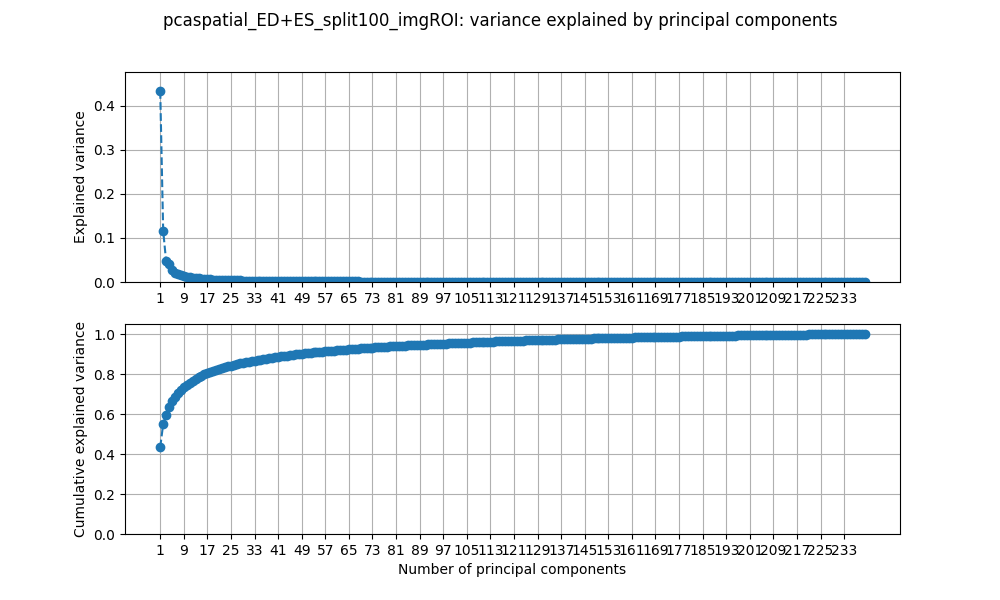
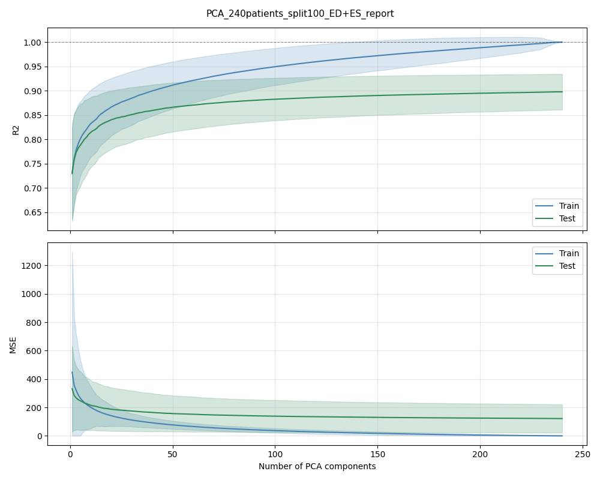
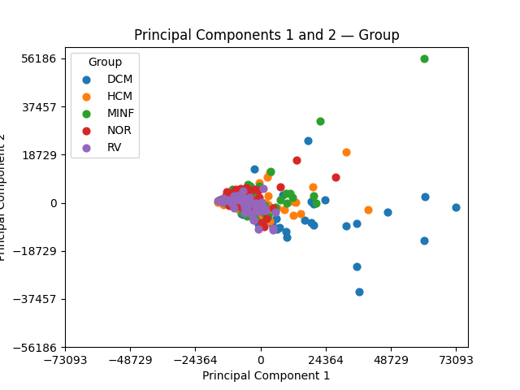
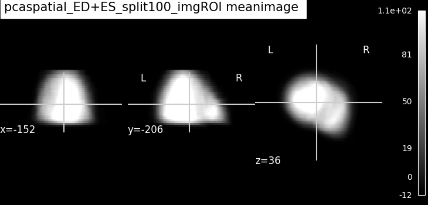
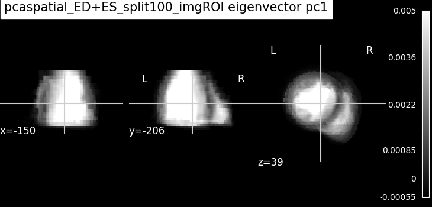
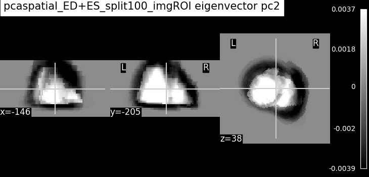

# 03 — Spatial PCA

> PCA *across* patients. Each registered 3D frame is one sample and each voxel a
> feature, so the principal components are the population's **anatomical modes** —
> the directions in which hearts differ most. This is the linear baseline that
> every later model (autoencoders, the AI-agent campaigns) is measured against.

## 1. Objective

Temporal PCA (report 01) described one patient's cycle; registration (report 02)
put every patient on a shared voxel grid. Spatial PCA now pools patients: with a
voxel meaning the same anatomical location everywhere, we can ask how the heart
*shape/appearance* varies across the train set population, how many components are needed
to reconstruct a held-out patient, and whether the latent coordinates carry
clinically meaningful structure (patient group, height, weight — picked up again
in report 04). Reconstruction quality (R²) on test patients makes this
the reference baseline for the autoencoders.

## 2. Method — what the code does

**Entry point:** [`scripts/run_pca_spatial.py`](../../scripts/run_pca_spatial.py)
**Config:** [`config_files/pca_spatial.yaml`](config_files/pca_spatial.yaml)
**Core functions:** [`src/data/loader.py`](../../src/data/loader.py), [`src/models/pca.py`](../../src/models/pca.py), [`src/models/pca_spatial.py`](../../src/models/pca_spatial.py)

Pipeline, in the order the script runs it:

1. **Load & split** (`loader.load_numpy_splits`) — flatten every registered frame
   into a row and stack them into `X` (samples = patients, one row per ED and per
   ES frame if `use_both_frames`. Only ED and ES frames are used because they have 
   the corresponding mask to select the ROI, 4d MRI files don't so it's unfortunately
   impossible to use all frames; features = voxels). Patients are split into
   train / val / test by a seeded, optionally group-stratified split
   (`special_split`, `stratify_ongroup`). Flattened arrays are cached as `.npy`
   in `processed_images/<cache_folder>` (`recalculate_x: false` reuses the cache).
   With `image_roi_only`, only the heart-ROI voxels are kept.
2. **Two-level centering.** First a **per-row** (per-patient) mean is subtracted to
   remove image-to-image brightness offsets; sklearn's `PCA` then subtracts the
   **per-voxel** mean (the population mean image). The row means are kept and added
   back at reconstruction time. This is the opposite choice from temporal PCA (which
   centers only once) — see notes.
3. **Fit PCA** on the training rows only (`PCA(n_components=min(n_train_rows, max_pc_calc))`);
   `val`/`test` are projected with `pca.transform`. The model is logged to MLflow
   as `pca_<frame_tag>.joblib` (experiment `pca_spatial`), with per-component
   explained-variance metrics.
4. **Reconstruction metrics** (`pca_spatial.pca_compute_metrics`) — for a list of
   latent dimensions, reconstruct each image from its first `n_pc` components
   (`pca_spatial_reconstruct`) and compute R²/MSE per image, aggregated per split;
   logged to MLflow stepped by latent dimension and plotted as R²/MSE vs number of
   components (train / val / test).
5. **Plots** — explained-variance curve; PC scores in the eigenbase (pairs up to
   `pc_max`, optionally coloured by group/height/weight); eigenvectors and the mean
   image rendered as MRI volumes (`plot_eigenvectors`); reconstruction comparisons
   for selected patients (`plot_reconstruction`).

**CALC vs LOAD.** `recalculate_pca: true` fits and logs; `false` + `load_run_id`
reloads the joblib and *validates* that the split parameters
(`split_name`, `n_train/val/test`, `frame_tag`) match the saved run before reusing it.

Key parameters (from `config_files/pca_spatial.yaml`):

| Parameter | Value | Meaning |
|-----------|-------|---------|
| `source_folder` | `registered_frames` | input = the registered frames from report 02 |
| `n_train` / `n_val` / `n_test` | `100` / `0` / `50` | patient split (×2 images each with `use_both_frames`) |
| `special_split` / `stratify_ongroup` | `split2` / `true` | seeded split, stratified on ACDC group |
| `use_both_frames` | `true` | use ED **and** ES (samples = 2 × patients) |
| `image_roi_only` | `true` | run PCA on heart-ROI voxels only |
| `original_shape` | `[128, 128, 32]` | 3D frame shape |
| `max_pc_calc` | `300` | cap on components (actual = `min(n_train_rows, 300)`) |
| `pc_max` | `6` | eigenbase scatter for PC pairs up to 6 (must be even) |
| `compute_metrics` / `plot_metrics` | `true` / `true` | reconstruction R²/MSE vs latent dim |

## 3. Results

Figure tag: `pcaspatial_ED+ES_split2_imgROI` (built from the config).

**Explained variance — anatomy is higher-rank than one cycle.** Population
anatomy varies in far more directions than a single patient's cardiac cycle, so
the variance is spread over many more components than in temporal PCA: it takes 
around 50 principal components to capture 90% of the variance. 

**Reconstruction R² vs number of components (held-out patients).** R² rises with
the number of PCs and saturates; the gap between train and test measures
generalisation. This curve is the **baseline the autoencoders are compared to** —
in the project's AE-vs-PCA comparisons PCA is the stronger reconstructor
(R² ≈ 0.9 on the development set).

**PC scores in the eigenbase.** Each point is one patient-frame; the leading PCs
spread patients along the dominant anatomical axes. Colouring by metadata
(`plot_metadata: true`) previews the class structure exploited in report 04.

**Anatomical modes (optional, `plot_eigenvectors: true`).** The mean image is the
average heart; each eigenvector, reshaped to a volume, shows where across the
population the intensity varies most.

## 4. Conclusion

Spatial PCA turns the registered population into an interpretable linear latent
space: a mean heart plus anatomical modes, with reconstruction quality that
generalises to held-out patients. It is a strong, cheap baseline — the reference
against which the human (reports 05–07) and AI-agent (reports 08–09) autoencoders 
are judged, and the latent representation fed to the classifiers/regressors in 
report 04.

## 5. Reproduce

- Take `pca_spatial.yaml` in `config_files/` from this folder, and put it in the
  general `configs/` folder.
- Run `scripts/run_pca_spatial.py` (needs the `registered_frames/` from report 02).
- For the anatomical-mode and reconstruction figures, set `plot_eigenvectors: true`
  and `plot_reconstruction: true` (both are off by default because they are slow).
- Expected outputs: the figures in `figures/`; model + metrics tracked in MLflow
  under experiment `pca_spatial`.

## 6. Notes & limitations

- **Only 2 frames per patient.** Only the "ED" and "ES" frames have the corresponding
  mask to crop the ROI from. The "4d" files - which have all the timeframes for the 
  patient - don't, and therefore can't be registered and used for the spatial PCA.
- **Two centerings, on purpose.** Row-centering removes per-image brightness
  (a nuisance across patients); column-centering removes the mean anatomy. This is
  the opposite of temporal PCA, where samples are frames of *one* patient and a
  single centering is correct. The row mean is stored and re-added at
  reconstruction. (`mask_bin: true` disables row-centering.)
- **Fit on train only.** Val/test are projected, never fitted — so the R² gap is a
  genuine generalisation measure, unlike a fit-on-everything PCA.
- **ROI-only by default.** `image_roi_only: true` restricts features to heart
  voxels; full-frame or masked/binary variants are available via `image_roi_only`,
  `mask_ys`, `mask_bin`.
- **Split matters.** Results depend on `special_split` / `stratify_ongroup`; LOAD
  mode refuses a run whose split parameters differ from the config.