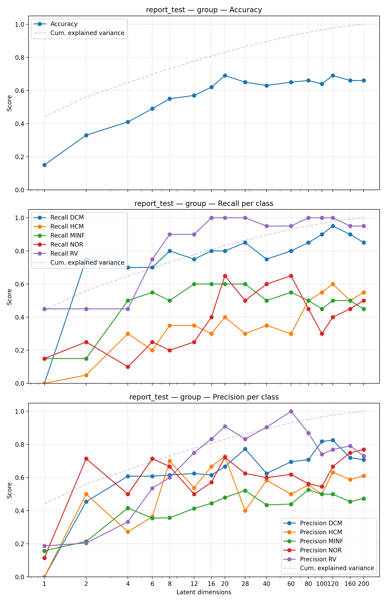
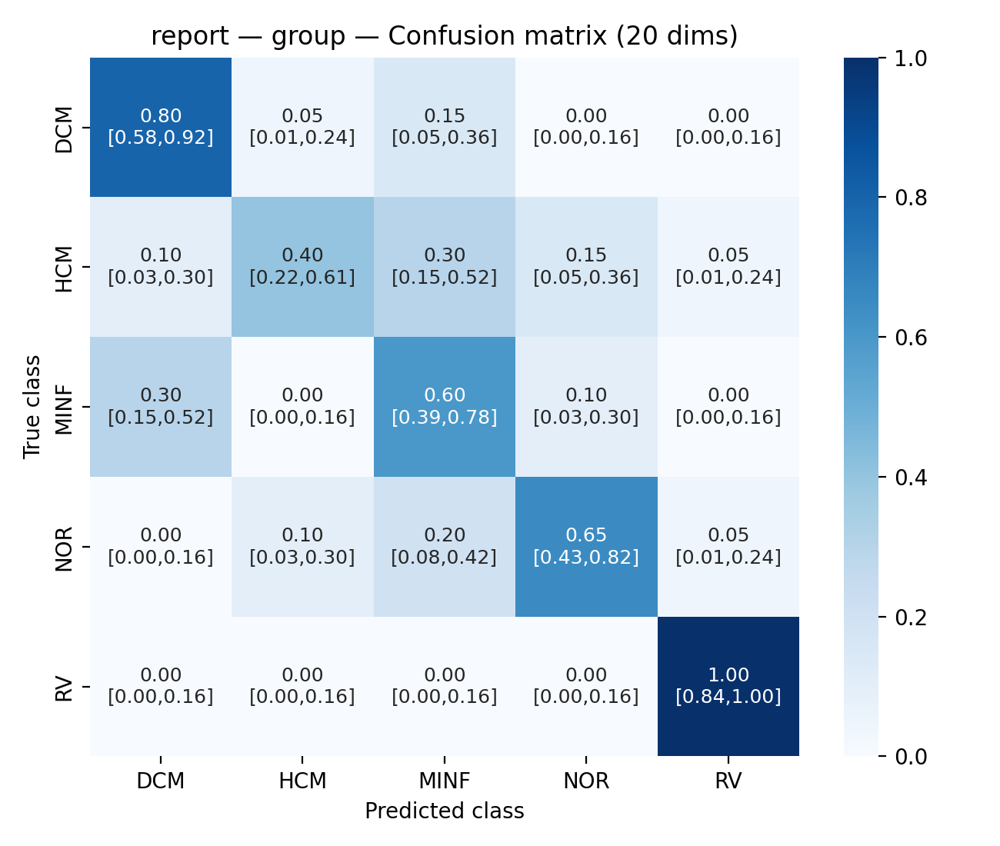
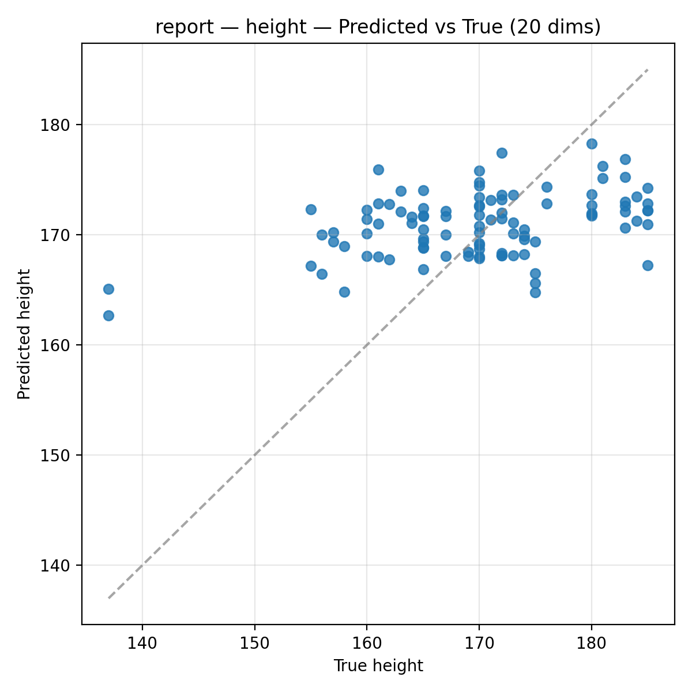

# 04 — Classification

> Predict the ACDC diagnostic **group** of a patient from a low-dimensional latent
> representation (PCA components from report 03, or AE latent from reports 05 and later),
> sweeping the number of latent dimensions. Logistic regression, random forest and
> XGBoost are compared. The same pipeline also does linear regression of patient
> metadata (height / weight), covered briefly at the end.

## 1. Objective

The latent spaces of reports 03 and 05+ compress a whole heart into a handful of
numbers. Are those numbers *clinically* meaningful — can a simple classifier
recover the ACDC group (DCM, HCM, MINF, NOR, RV) from them, and how many latent
dimensions does it take? This stage answers that with simple, standard classifiers, 
so the result reflects the quality of the representation rather than of a 
specially-tuned classifier. It is also the plain-classifier baseline that the later 
AI-agent classification campaign reuses to score architectures on accuracy.

## 2. Method — what the code does

**Entry point:** [`scripts/run_regression.py`](../../scripts/run_regression.py)
**Config:** [`config_files/regression.yaml`](config_files/regression.yaml)
**Core functions:** [`src/models/regression.py`](../../src/models/regression.py), [`src/visualization/regression_plots.py`](../../src/visualization/regression_plots.py)

Pipeline, in the order the script runs it:

1. **Get the latent features**, from one of two sources:
   - `source_type: pca` — load a pre-trained PCA from a `pca_spatial` MLflow run
     (`pca_run_id`), project the data, and sweep the first `n_pc` components over
     `latdim_list_pca`.
   - `source_type: ae` — find all autoencoder runs matching `ae_source`
     (`model_name` / `experiment_tag` / `split_name` + optional `params_filter`),
     group them by `latent_dimensions`, and collect each run's latent vectors.
   Either way the result is a sweep: one classifier per latent dimension.
2. **Build the target** `Y` from patient metadata (`y_name`): `group` (5-class,
   or one-vs-rest if `group_binary`), or `height` / `weight` (linear regression).
   The train/test split follows the source run: only `n_train` and `special_split` 
   are set in `regression.yaml` (with `n_test = 150 − n_train - n_val`), while 
   stratify_ongroup and the frame configuration are inherited from the source PCA/AE 
   run's stored parameters. The split uses the same `get_split_indices` as the PCA/AE 
   splits, and is *verified* against the source run's stored split parameters.
3. **For each latent dimension**: fit a `StandardScaler` on `X_train`, fit the model
   (`classifier_type`: `logistic` / `random_forest` / `xgboost`, or `LinearRegression`
   for height/weight), evaluate on the test set, and log metrics stepped by
   `n_dims`. Each fitted model is saved as a joblib artifact.
4. **Metrics & plots**: classification → accuracy, ROC-AUC (binary) or macro +
   per-class precision/recall (multiclass), and a normalized confusion matrix with
   confidence intervals at `n_pc_confusion` dims; regression → R², RMSE, MAE and a
   predicted-vs-true plot. One MLflow run per execution in the `regression`
   experiment.

`plot_only: true` reloads metrics from a past run and replots; `compare_mode`
averages confusion matrices across several regression runs (splits).

Key parameters (from `config_files/regression.yaml`):

| Parameter | Value | Meaning |
|-----------|-------|---------|
| `y_name` | `group` | target: `group` (classification) / `height` / `weight` (regression) |
| `classifier_type` | `logistic` | `logistic` / `random_forest` / `xgboost` |
| `n_train` / `n_val` | `100` / `0` | patient split (`n_test = 150 − n_train - n_val = 50`) |
| `special_split` | `null` | split seed (`null` = sequential default) |
| `source_type` | `ae` | features from `pca` or `ae` latent |
| `latdim_list_pca` | `[1, 2, 4, …, 200]` | latent dimensions swept (PCA source) |
| `n_pc_confusion` | `20` | latent dim at which the confusion matrix is drawn |
| `random_forest` / `xgboost` | see YAML | tree/boosting hyperparameters |

## 3. Results

Figures use `run_label = experiment_tag` from the config.

**Accuracy vs number of latent dimensions.** Accuracy rises quickly with the first
few dimensions and then plateaus — adding components beyond ~20 barely helps. On
5 balanced ACDC groups, chance is 0.20, so the plateau is well above chance.

**Classifier comparison.** Random forest and XGBoost bring **no significant
improvement** over plain logistic regression; the spread *between splits* is
larger than the spread *between classifiers*.

| Classifier | Test accuracy (across splits) |
|------------|-------------------------------|
| Logistic regression | ≈ 0.62 – 0.68 |
| Random forest | ≈ 0.63 – 0.67 |
| XGBoost | ≈ same, no significant gain |

**Confusion matrix (at 20 dims).** The errors are structured, not random:
**RV and DCM are well separated**, while **NOR, MINF and HCM** are frequently
confused with one another. The same structure shows up directly in the AE latent
space (RV/DCM isolated at latent dim 16), so it reflects the data, not the
classifier.

**Metadata regression (height / weight).** Running the same script with
`y_name: height` or `weight` fits a linear regression instead. Height is weakly
predictable (**R² ≈ 0.2**); weight carries essentially no signal in the latent
space (**R² ≈ 0**).

## 4. Conclusion

A simple classifier recovers the ACDC group from ~20 latent dimensions at roughly
0.65 accuracy — three times chance — with a clinically sensible error structure
(RV/DCM easy, NOR/MINF/HCM confusable). Because random forest and XGBoost do not
beat logistic regression, the ceiling is set by the *representation*, not the
classifier — which is exactly why the later work optimises the encoder
(reports 05–08) rather than the classifier. Patient height is weakly recoverable,
weight is not.

## 5. Reproduce

- Take `regression.yaml` in `config_files/` from this folder, and put it in the
  general `configs/` folder.
- Point it at a source: for PCA latent (report 03) set `source_type: pca` and
  `pca_run_id`; for AE latent set `source_type: ae` and fill `ae_source`.
- Run `scripts/run_regression.py`. For the classifier comparison, rerun with
  `classifier_type` set to `logistic`, `random_forest`, `xgboost`. For metadata,
  set `y_name` to `height` / `weight`.
- Expected outputs: the figures in `figures/`; one MLflow run per execution under
  experiment `regression` (metrics stepped by `n_dims`, models saved as artifacts).

## 6. Notes & limitations

- **Variance.** Two sources of variance matter here. Across training seeds (same 
  split), accuracy moves by ≈ ±0.03. Across splits (different 100/50 patient partitions) 
  it moves much more — on a 5-split run at latent dim 20, test accuracy ranged 0.50–0.73 
  (std ≈ 0.06–0.09). Single-split numbers should therefore be read as ranges; 
  use `compare_mode` to average over splits.
- **ED+ES correlation.** With `use_both_frames`, ED and ES of a patient are
  correlated, inflating the apparent sample size; logistic `C` auto-halves to
  `0.5` to compensate.
- **Scaling.** A `StandardScaler` is fit on train and applied to test for all
  models (not needed for trees, kept for consistency). All models use fixed
  `random_state=42`.
- **Split verification.** The script refuses a source run whose stored split
  parameters differ from the config, so features and targets can't silently
  misalign.